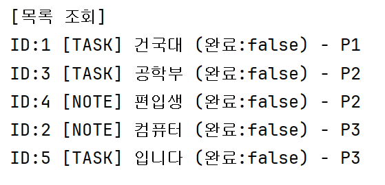
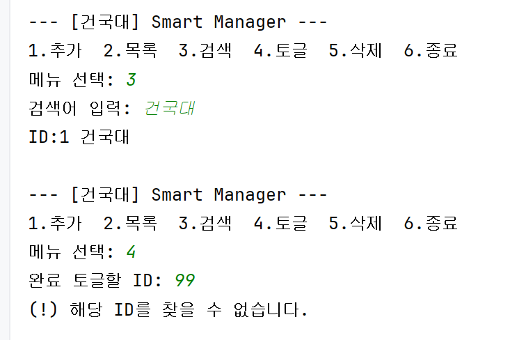
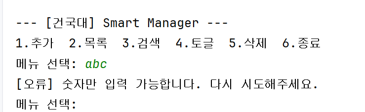

# Week 02 — Smart Task & Note Manager

1. 개발 환경
- 언어: Kotlin
- 도구: Android Studio
- 제출: GitHub Classroom

2. 구현 기능 체크리스트
- 숫자 아닌 입력을 넣어도 죽지 않음
- 추가, 목록, 검색, 토글, 삭제 기능 정상 동작
- 존재하지 않는 ID 처리 (“해당 id 없음” 출력)
- 패키지 구조 분리 (ui, data, service, util)
- 고차함수(filter, sortedBy, forEachIndexed) 활용

3. 메뉴별 실행 결과
 1) 항목 추가 및 목록 조회
- 

 2) 검색 기능 및 ID 예외 처리
- 

 3) 입력 방어 (숫자 외 입력)
-